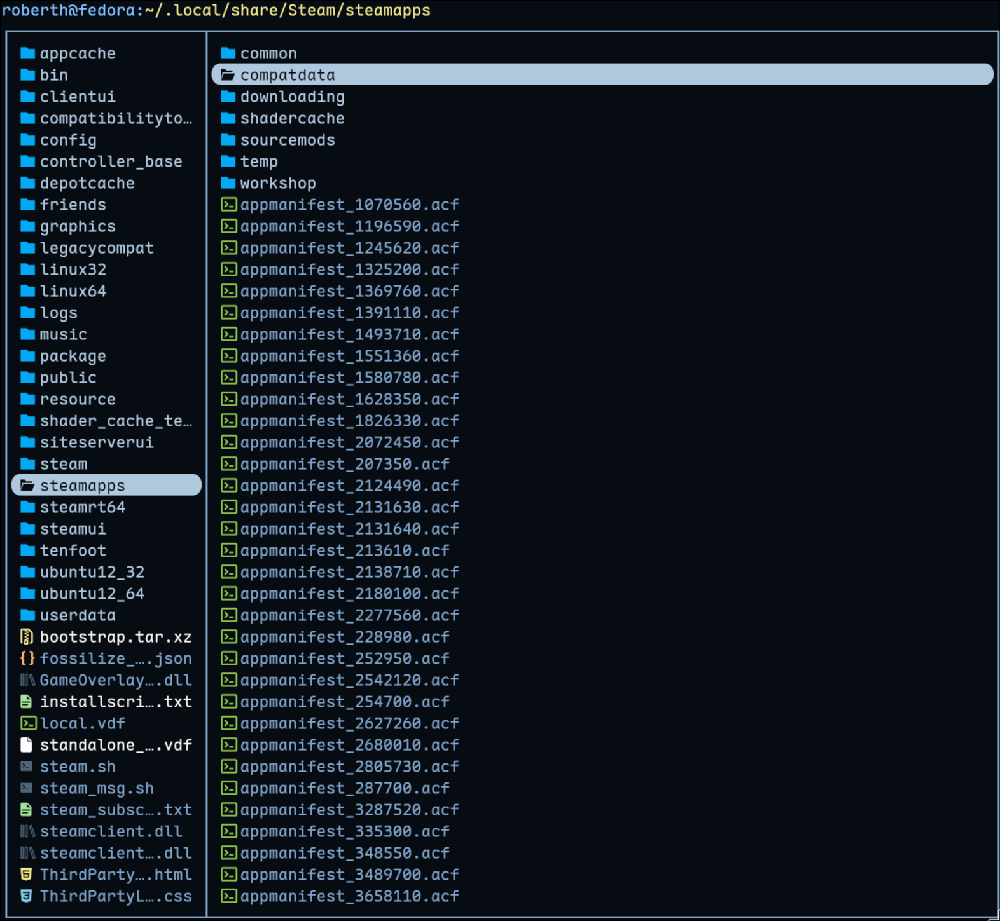
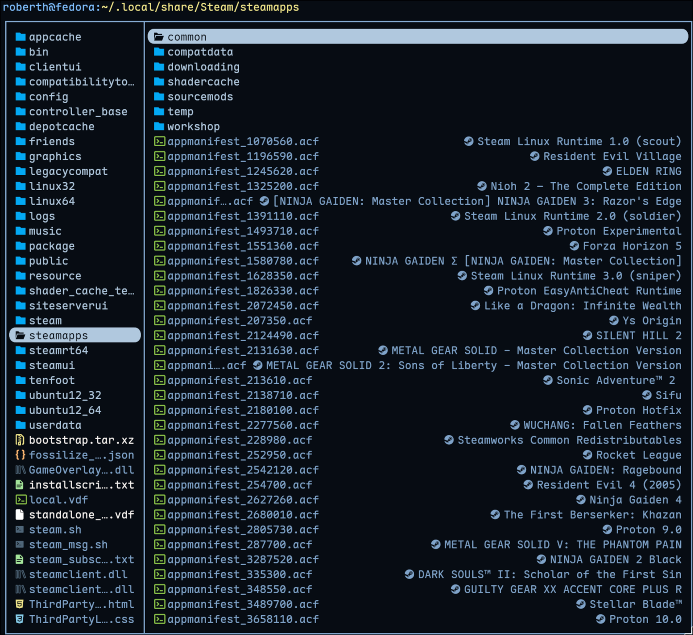

<p align="center">
  
</p>
<h1 align="center">steam-appid.yazi</h1>

<p align="center">
  <a href="https://github.com/uhs-robert/steam-appid.yazi/stargazers"></a>
  <a href="https://github.com/sxyazi/yazi" target="_blank" rel="noopener noreferrer"></a>
  <a href="https://github.com/uhs-robert/steam-appid.yazi/issues"></a>
  <a href="https://github.com/uhs-robert/steam-appid.yazi/contributors"></a>
  <a href="https://github.com/uhs-robert/steam-appid.yazi/network/members"></a>
</p>

<p align="center">
  A <a href="https://github.com/sxyazi/yazi">Yazi</a> linemode plugin that resolves Steam AppIDs to game names. Browse your <code>steamapps</code> folder and see game names instead of raw IDs.
</p>

<table>
  <tr>
    <td align="center"><br><strong>BEFORE</strong></td>
    <td align="center"><br><strong>AFTER</strong></td>
  </tr>
</table>

<p align="center">
  <a href="./NEWS.md">✨ What's New / 🚨 Breaking Changes</a>
</p>

## How it works

The plugin reads `appmanifest_<id>.acf` files from your `steamapps` directory and displays the `name` field inline. It activates for:

- **`appmanifest_*.acf` files** inside `steamapps/`
- **Numeric ID folders** inside `steamapps/downloading/`, `compatdata/`, `shadercache/`, and `temp/`

Game names are cached in memory for the session, so repeated lookups don't hit disk.

## Requirements

- [Yazi](https://github.com/sxyazi/yazi) 0.25+
- Steam installed with at least one `steamapps` directory

## Installation

```sh
ya pack -a uhs-robert/steam-appid
```

## Setup

Add the following to your `~/.config/yazi/init.lua`:

```lua
local steam_appid = require("steam-appid")
steam_appid.setup()

function Linemode:steam_appid()
  return steam_appid.linemode(self)
end
```

Enable the linemode in your `~/.config/yazi/yazi.toml`:

```toml
[mgr]
linemode = "steam_appid"
```

## Configuration

All options are optional. Defaults shown below.

| Option            | Type       | Default                          | Description                                                                                      |
| ----------------- | ---------- | -------------------------------- | ------------------------------------------------------------------------------------------------ |
| `steamapps_paths` | `string[]` | `~/.local/share/Steam/steamapps` | Paths to search for `appmanifest_*.acf` files. Add extra entries for additional Steam libraries. |
| `icon`            | `string`   | `󰓓`                              | Icon prepended to the game name. Uses the Nerd Font steam icon. Set to `""` to disable.          |

### Handling Multiple Steam libraries

```lua
steam_appid.setup({
  steamapps_paths = {
    os.getenv("HOME") .. "/.local/share/Steam/steamapps",
    "/mnt/games/Steam/steamapps",
  },
})
```
